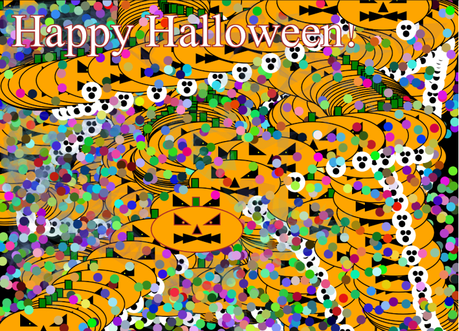

# Schrielle Standish


### Homework:

1. #### Summarize the work you did this homework cycle. Paying particular attention to the individual choices you made.

## ` Summary`

Making functions and learning how to input them into a code!


2. #### What steps did you take to complete the assignment?

## ` Steps Taken`

- Read through last week and this week.
- Looked at my old pumpkin code
- Made the pumpkin stationary, and following the mouse while inputting it into a function with parameters.
- Proceeded to make another function and name it ghost.
- Repeated step three.

#### Did you have any problems or issues? How did you solve these? Did you post about these to the class repo issue tracker? Did you receive any useful feedback from your classmates?

## `Problems or Issues`

Too easy this week. No problems.

3. #### Is there anything in particular you learned that you would like to discuss further?

## `Particular interest in learning more`

FINALLY I CAN DUPLICATE THINGS.

4. #### What issues did you help your fellow classmates out with this past homework cycle?


## `Help`
```
Did not provide help.
```

##  IMAGE OF MY EDITOR

