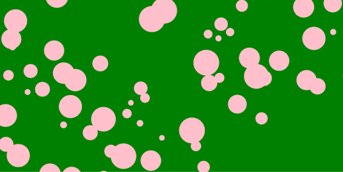

# Schrielle Standish

### Homework:

1. #### Summarize the work you did this homework cycle. Paying particular attention to the individual choices you made.

## ` Summary`

creating classes and objects and 'this' and such.

2. #### What steps did you take to complete the assignment?

## ` Steps Taken`

- Read through last week and this week.
- took a look at shifmans code
- Decided what I wanted to keep / edit about the code.
- Thought about making my own.
- Decided I wanted to instead tweek his.
- Took the code, learned its eliments, changed the 'bubbles' into pink dots.
- Made the dots respond to not only mouse dragging across the screen but also
  mouse clicks.
- changed the bubbles sizes.
#### Did you have any problems or issues? How did you solve these? Did you post about these to the class repo issue tracker? Did you receive any useful feedback from your classmates?

## `Problems or Issues`

Had a hard time grasping what classes were. Once I figured that out, figured out how to put them in with everything and what Delta was (thank you for that explanation this week) I was good.

3. #### Is there anything in particular you learned that you would like to discuss further?

## `Particular interest in learning more`

Bubbles o,..,o -feeling like the yellow fish from finding nemo-

4. #### What issues did you help your fellow classmates out with this past homework cycle?

## `Help`
Did not help anyone this week but a guy gave a positive message to the group.
So I sent him one back as a comment on his post.

##  IMAGE OF MY EDITOR

