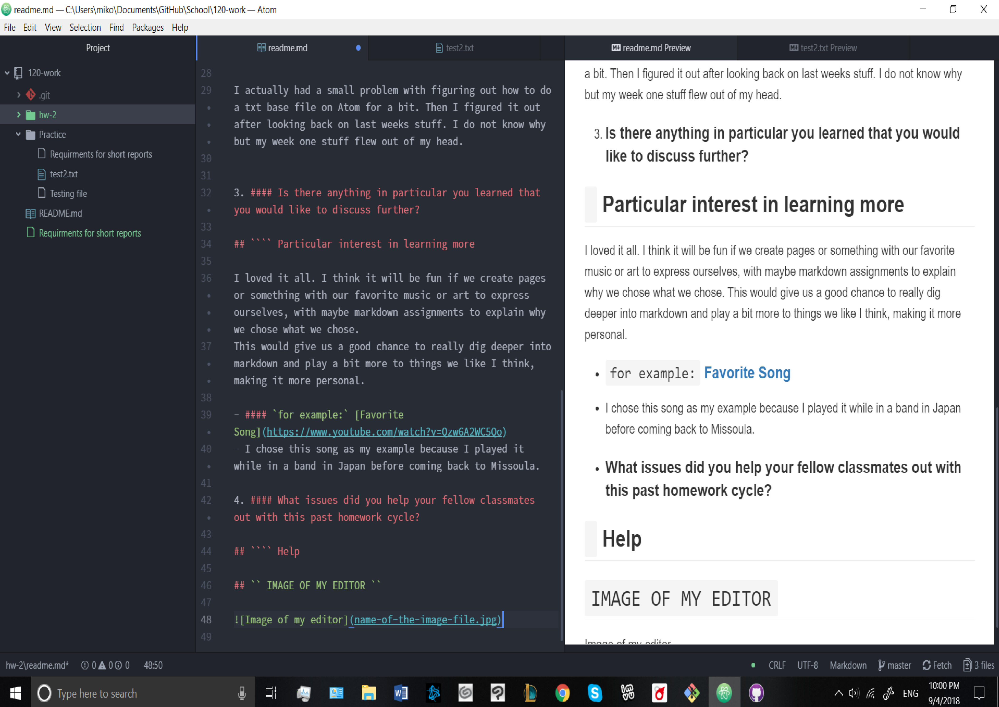

#  Schrielle Taileah Standish

### Homework:

1. #### Summarize the work you did this homework cycle. Paying particular attention to the individual choices you made.

## ` Summary`

This homework cycle I worked on markdown files as well as;
- creating my github account,
- syncing it to my github Desktop,
- and learning how to make my files properly with CLI work.

This amount of work was done with a lot of effort to help myself learn how to properly work through txt files. I really like the markdown style because its used a lot when working on webpages. It is relatively easy to understand and straight forward to follow.


2. #### What steps did you take to complete the assignment?

## ` Steps Taken`

- The first thing I did was follow all of the examples given.
- I also watched all of the videos we were assigned to see what was going on.
- As one can see on my github page I also played around a bit with creating txt based documents.
This was a lot of fun.
- I'm currently having fun playing around with the paragraph maker for markdown documents as I write this.
- Mostly I just followed the examples and played a bit by myself, figured out how to make links and such.

#### Did you have any problems or issues? How did you solve these? Did you post about these to the class repo issue tracker? Did you receive any useful feedback from your classmates?

## `Problems or Issues`

I actually had a small problem with figuring out how to do a txt base file on Atom for a bit. Then I figured it out after looking back on last weeks stuff. I do not know why but my week one stuff flew out of my head.


3. #### Is there anything in particular you learned that you would like to discuss further?

## `Particular interest in learning more`

I loved it all. I think it will be fun if we create pages or something with our favorite music or art to express ourselves, with maybe markdown assignments to explain why we chose what we chose.
This would give us a good chance to really dig deeper into markdown and play a bit more to things we like I think, making it more personal.

- #### `for example:` [Favorite Song](https://www.youtube.com/watch?v=Qzw6A2WC5Qo)
- I chose this song as my example because I played it while in a band in Japan before coming back to Missoula.

4. #### What issues did you help your fellow classmates out with this past homework cycle?


## `Help`
```
I helped Zeemakn out (I think) with his issue of opening files on Atom with windows. Since I use both of those, I hope what I said helped him. I'm not sure.

 I was also having that issue before going to week one and rereading everything.

```
##  IMAGE OF MY EDITOR

