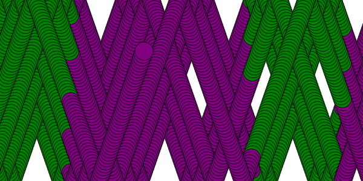

# Schrielle Standish

### Homework:

1. #### Analyzing the code

## ` Describe, in detail, what the original code is doing.`

- In this code you can see moving parts. The first set up assigns variables their positions, giving x and y valuables names as well as
  cordinates names to make things easier to edit later.
- After assigning variables the set up was used to create the basic canvas on which one will use.
- From there the 'draw' set up will be used to edit the drawing.
- Then you define what ball.x and ball.y will be. this makes ball.x (aka 10) += 1 times 1 or (ball.delta_x *ball.scale_x)
  and same for ball.y
- Then it defines the conditions for how the ball moves. IF the ball.x exceeds the with, OR ball.x is less than 0
  the ball then moves back in the other direction along the x axes.
- This is also the same for ball.y, except on the y axes.
- Then the ball is drawn with the ellipse function
- After that it makes the condition that if the mouse is pressed, the ball will then change size, based on the parameters listed.
- This was the base code.

2. #### MY CODE

- I simply added a color changer. So when the ball goes a certain place past the x axes it goes purple, too far and it goes green.
- It then does that one more time.

